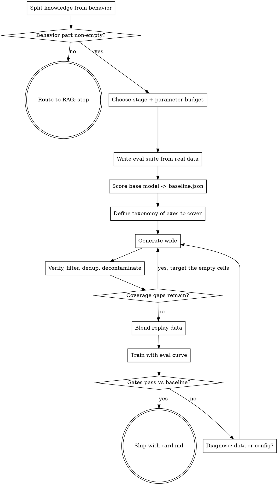

# Building Fine-Tuning Datasets

A fine-tune is its dataset. Hyperparameters decide whether training converges; the dataset decides what
the model becomes. Most disappointing fine-tunes are correctly-configured runs over data that encoded
the wrong thing.

Two failures cause most of the damage, and both are settled before a single example is generated:
teaching facts that belong in retrieval, and having no way to detect that the model got worse at
everything else.

## Gate 1: Is this a knowledge problem?

If the goal contains "so it knows our X" — product names, runbook facts, current inventory, policy
details — that part is a retrieval problem, and fine-tuning is the wrong tool for it.

Models acquire facts in pretraining; fine-tuning teaches them to *use* what they have. Examples carrying
genuinely new facts are learned much more slowly than ones consistent with existing knowledge, and as
they finally are learned they **linearly increase the model's tendency to hallucinate** (Gekhman et al.,
EMNLP 2024, measured on closed-book QA). The rate is measured over the whole evaluation, not just the
newly taught items — so the cost lands on factuality generally, and it grows the longer you train to
make the new facts stick.

Split the request explicitly before proceeding:

| Part of the goal | Where it goes |
|---|---|
| Facts, documents, entities, anything that changes | RAG |
| Format, structure, house style, tone | Fine-tuning |
| Task procedure, tool-call syntax, reasoning style | Fine-tuning |
| Domain vocabulary and question shapes over retrieved context | Fine-tuning, with facts still retrieved at inference |

Say which parts you routed where. A user asking for one thing usually wants both halves solved, not the
retrieval half silently folded into the training set.

## Gate 2: Which technique

Stage and parameter budget are independent choices. Read `references/choosing-technique.md` before
committing — it covers prompt/RAG/decoding alternatives, continued pretraining vs SFT vs preference
optimization vs RL, DPO/KTO/ORPO/SimPO selection, full FT vs LoRA vs QLoRA, and required stage ordering.

Short version: if you can write the correct output, **SFT**. If you can only say which of two outputs is
better, **preference optimization**. If a script can verify correctness and SFT has plateaued, **RL**.
Default parameter budget is **LoRA**, or QLoRA when VRAM-bound.

## Gate 3: Does the base model already do it?

Before generating data for any capability or behavior, **probe the base model on it** — a couple dozen
samples across the cases you care about — and only keep the slices it measurably fails. This is Gate 1's
knowledge rule generalized: fine-tuning is for what the model gets *wrong*, and training a slice it
already handles is not neutral.

The two costs are real and documented:

- **Wasted effort.** A team building a behavior dataset probed their base model and found it already
  passed one entire behavior at ~94% with no reproducible failure pattern — they dropped 150 rows that
  would have taught nothing.
- **Active regression.** The same narrow behavioral fine-tune, ~750 rows, caused a measurable
  general-capability regression on four reasoning benchmarks (grade-school math down ~10–16pp) that
  nobody saw until the benchmark panel ran, because the run had no eval split. Every row you add can
  cost capability elsewhere; rows that teach nothing pay that cost for no gain.

So the probe is not optional diligence — it decides what goes in the dataset. Keep the confirmed-failing
cases, resample the ambiguous ones (a 1-of-3 refusal is sampling noise, not a failure — single-shot
refusal evaluation is only ~92% accurate, Larsen et al. 2025), and drop what the base model already
does. Report confirmed categories as a rate ("2/3", "3/3"), not a binary: a 2/3 confirmation is a
watch-item, not a solved one, since under pure noise it still confirms ~26% of the time, and it is
exactly the category to re-probe after the next training run.

## The deliverable

A fine-tuning dataset is not a file of examples. It ships as eight parts, and a handoff missing any of
them cannot be evaluated or reproduced. Deliver them in this order — the order is the method:

1. **`eval/` — the held-out suite, built first.** Real examples only, reserved before generation. Three
   subsets: *task* (held-out real examples of the target behavior), *retention* (general-capability
   probes the base model already passes), *behavior* (refusals, safety, tone invariants to preserve).
2. **`baseline.json` — the base model scored on all three subsets** before any training. Without this
   there is no denominator and "it looks good" is not a result.
3. **`taxonomy.md` — the axes the data must cover**, with a target count per cell. Diversity comes from
   varying what you condition on, so the axes have to exist on paper before generation and be re-counted
   after filtering. Empty cells are the next generation round's target, not an acceptable outcome.
4. **`train.jsonl` / `val.jsonl` / `test.jsonl`** in messages format, split by *source document* so
   synthetic siblings never straddle the boundary, deduplicated at all three levels (exact,
   near-duplicate, semantic), and decontaminated against every eval set you intend to report.
5. **The replay mix** — task data blended with general instruction data at a stated ratio, so the model
   does not lose what it already had.
6. **A verified format contract** — which loss-masking flag matches your dataset format
   (`assistant_only_loss` for messages, `completion_only_loss` for prompt/completion), which EOS token
   the chat template actually emits, and confirmation of both by decoding one training batch. A wrong
   flag trains on the user's turns and a wrong EOS produces a model that never stops; neither shows up
   as a bad loss curve, which is why this is a checked artifact rather than a habit.
7. **`card.md` — provenance.** Seed source, generator model and version, generation prompts, filters and
   thresholds, dedup and decontamination method, counts per taxonomy cell, license and terms.
8. **`config.yaml` — the training config**, with the eval curve enabled so overfitting is visible while
   it happens.

Building the eval set first is what stops the dataset from being optimized toward whatever the generator
happened to produce.

**Write every prose artifact skeleton-first, one section per edit.** A single tool call cannot emit more
than roughly a thousand tokens, and the plan, taxonomy, and card all run longer, so a one-shot write
truncates mid-string and the call fails. Write the file with its headings and a one-line stub under
each, then replace one stub per edit. Start this way rather than falling back to it — the skeleton
costs nothing and the sections land in the same number of edits either way.

## Generate with a script, not by hand

**You write the pipeline; the pipeline writes the data.** Emitting training examples yourself, one at a
time into a JSONL file, is the wrong shape for this work no matter how few examples you need:

- **It does not scale.** Three hundred examples at ~800 tokens each is far past what any agent can emit,
  and you will produce a truncated file while believing you produced a dataset.
- **It is not reproducible.** A dataset you cannot regenerate is one you cannot fix. A script plus a
  seed, a pinned generator model, and a versioned prompt can be re-run when you find a defect.
- **The generation loop is genuinely a loop.** Generate into taxonomy cells → verify → filter → dedup →
  re-count coverage → generate into the cells that came up short. That cycle runs several times and
  cannot be done by hand.
- **Filtering needs code anyway.** MinHash near-duplicate detection, embedding nearest-neighbor
  thresholds, and n-gram decontamination are not eyeball operations.

So the artifacts you hand-author are the *inputs*: the taxonomy, the generation prompts, the seed
examples, the filter thresholds. Everything downstream is produced by running something.

`scripts/generate.py` and `scripts/curate.py` in this skill are a working reference pipeline —
taxonomy-driven generation with resume, then dedup, decontamination, and a coverage report. Read them,
adapt the prompts and taxonomy to the task, and run them; they are a starting point, not a framework.
Prefer extending them over writing a pipeline from scratch.

## Order of work

The loop back from coverage gaps is the step most pipelines skip. Generation is cheap and filtering is
destructive, so generate wide and filter down — then look at which taxonomy cells came out empty and
generate *specifically* into those, rather than running the same unconditioned loop again and getting
the same modes back.

## Quality over quantity, with numbers

Within a *fixed budget*, curated hundreds beat unfiltered tens of thousands for **general instruction
and style** — the consistent result across LIMA (1,000 curated competitive against 50k), AlpaGasus, and
LIMO (817 reasoning traces). That is what those papers measured, and it does not transfer to
*overriding a base prior* (a safety refusal, a strong default): there the behavior needs both a minimum
*count* and a minimum *share of the mix*, and a small set of rephrased variants of a handful of scenarios
is the least-favorable regime for "less is more." Judge which regime you are in before reaching for the
quality-over-quantity conclusion. Typical ranges:

| Goal | Examples |
|---|---|
| Format / structure conversion | 100–1,000 |
| Style, tone, voice | 500–2,000 |
| Classification / extraction | 50–500 per class |
| General instruction following | 1,000–10,000 |
| Reasoning distillation | 800–10,000 verified traces |

When a run underperforms, **doubling the data is usually the wrong reflex** — and specifically wrong when
the extra rows are rephrasings of scenarios you already have: at a fixed update budget, repeating a small
set causes the same world-knowledge forgetting as scaling, and a narrow, repetitive dataset is the
mode-collapse setup. The data move that *does* help retention is adding **new** general replay, not more
of the target behavior. Check in this order: **LR** (retention-side, first), then target modules, then
diversity, then mix.

## Degradation gates

Run these against `baseline.json` before calling a fine-tune successful. Each maps to a documented
failure mode, and passing the task metric while failing these is the most common way a bad model ships.

| Gate | Check | Action if it fails |
|---|---|---|
| Task | Target metric improved on held-out real examples | The fine-tune did nothing — check LR and target modules |
| Retention | Above run-to-run noise (≥1 SE at your n) on capabilities the base already passed | A single-digit drop on a few benches is a *common* LoRA-SFT outcome, not "catastrophic" (the literature's catastrophe is a bench near 0, e.g. SLIM's MMLU→0.00). Fix in this order: **lower LR** (retention-side, see `lora-configuration.md`) and **add a replay mix** — the evidence-backed levers — then a val split + small `lora_dropout` as cheap overfitting control, then fewer epochs |
| Factuality | Hallucination rate not above base | You taught unknown facts — move them to RAG |
| Safety | Refusal behavior preserved | Safety alignment degrades even from purely benign data (Qi et al., ICLR 2024) — add safety examples to the mix |
| Format | Outputs terminate and parse | EOS or chat-template bug, not a data problem |
| Diversity | Outputs not collapsed to one phrasing | Overfitting — fewer epochs, lower LR, or scale alpha by 0.5 |

Measuring only the task metric is how a model that got 10 points better at one thing and 15 worse at
everything else gets shipped.

## References and scripts

Read the reference you need; do not load all five.

| File | Covers |
|---|---|
| `references/choosing-technique.md` | RAG/prompting alternatives, CPT vs SFT vs DPO vs RL, DPO/KTO/ORPO/SimPO, full FT vs LoRA vs QLoRA, stage ordering |
| `references/synthetic-generation.md` | Quality/diversity/complexity tradeoff, Self-Instruct, Evol-Instruct, Magpie, personas, doc-grounded QA, self-chat, trajectories, distillation, verification and judge bias, model collapse, licensing |
| `references/data-quality.md` | Eval set construction, sizing, dedup levels, decontamination, balance, mix-share to override a base prior, messages format, loss masking, EOS, chat templates, split leakage, dataset cards |
| `references/lora-configuration.md` | rank, alpha, target modules, LR, schedule, packing, dropout/val as regression levers, rsLoRA/DoRA/LoRA+/PiSSA, worked configs, symptom-to-knob table, merging |
| `references/avoiding-degradation.md` | Forgetting mechanisms, replay ratios and sources, unknown-knowledge and unknown-capability detection, safety regression, overfitting and collapse symptoms, gate thresholds |

The `scripts/` are a runnable reference pipeline — adapt, don't rewrite:

| Script | Does |
|---|---|
| `scripts/generate.py` | Taxonomy-driven generation against any OpenAI-compatible endpoint, resume-aware, records provenance per row |
| `scripts/curate.py` | Malformed-drop → exact/near-dup dedup → decontaminate against eval files → per-cell coverage report (stdlib only) |

## Common mistakes

| Mistake | Why it bites |
|---|---|
| Fine-tuning to inject facts | Slow to learn, and linearly increases hallucination as it does |
| `alpha = 0.5r` | Backwards. Use `alpha = 2r` (or `r`); keep `alpha/r` ≥ 1 |
| Targeting attention only | MLP layers carry the higher-rank updates — target all linear layers |
| Splitting after augmentation | Synthetic siblings straddle train/test and the score is fiction |
| No base-model measurement | No denominator; regressions are invisible |
| No replay data in the mix | The model gets the task and loses everything else |
| Raising temperature for diversity | Diversity comes from varying conditioning — personas, taxonomy cells — not sampling noise |
| Trusting an unvalidated LLM judge | Position, verbosity, and self/familiarity-preference bias measure the wrong thing. For *code* quality, deterministic checks (syntax, execution, schema) are the validated layer — the judge is an advisory ranking, not a pass/fail gate |
| Deduplicating exact matches only | Synthetic pipelines overproduce semantic near-duplicates that exact hashing misses |
| Packing a small dataset | No throughput to gain on hundreds of rows, and cross-contamination risk on multi-turn data — leave it off |
| Training a slice the base model already passes | Wasted rows at best; every added row can cost capability elsewhere |
| No validation split | No eval-loss curve means regressions stay invisible until the model ships |
| Ignoring the teacher's terms of service | Major API providers restrict training on their outputs; this blocks release, not development |
